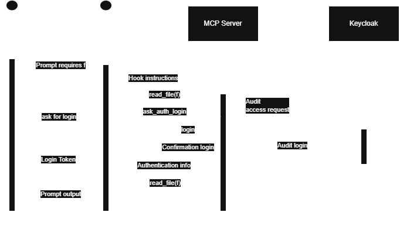

# PABEL - (**P**lugin **ABE** for **L**LM)
A plugin that ensures confidenciality in a corporate enviornment via **A**ttribute **B**ased **E**ncryption

## Assumptions
We assume that a given file _f_, which holds reserved information, is structured with the following criterias:
- It is a file with one or more parts encrypted with ABE
- Each encrypted part is intended to be seen only by the attribute-matching employee
- There can be limitations, company wise, about the use of one or more specific llms
## Use cases
### UC1: User wants to access _f_ via AI agent
**Primary Actor**: User

***Goals***:

**User**: Wants to decipher _f_, revealing in plaintext the parts that competes to him, via an AI Agent.

**Company**: Wants that each encrypted file (i.e. _f_) is handled minimizing possible confidenciality issues.

**IT/Cybersec Department**: Want to log every use of confidential files, (i.e. *who* is doing *what* to *what file* and at *which time*)

**Pre-condition**: The company has, beforehand, created a pair `<private_key, User>` and stored it. Each User of said pairs has to be accurately represented by the set of attributes used to create the private key.

**Post-condition**: User correctly read a deciphered version of _f_ (say _f'_) via AI Agent, which had to comunicate via MCP Server. The servere (as a black box) retrieved the informations needed to obtain _f'_ and it has sent back to the Agent, ensuring the log of every step.
### Main scenario
1. User prompt its AI Agent of choice to do some action that involves _f_
2. The AI Agent understands that _f_ is an `.abe` file and s.t. it is redirected by a hook.
3. ~~The hook instructs the Agent to comunicate with the MCP Server.~~ **Revised, see "Design evolution" below: the hook itself communicates with the MCP Server - the Agent is never instructed to, and never does.**
4. The MCP Server checks the properties for both User and Agent and elaborates the request(s).
5. The Agent has the needed _f'_ and can perform the operations needed.
6. The User has its desired output.
7. UC repeats itself until the User is satisfied.
### Alternative Scenario
- *a The User, without the help of an Agent, wants to read _f_ and asks the MCP Server for _f'_.
    - *a.1 The server identificate the User.
    - *a.2 The user is identified and is provided with _f'_.
        - *a.2.a The user is not identified and the access to _f'_ is denied.
        - *a.2.b The UC terminates

- 4.a The checks provided by the MCP Server don't grant access to the User or the Agent
    - 4.a.1 The MCP Server sends an error and log the event
    - 4.a.2 The Agent inform the User about the insuccess.
    - 4.a.3 The UC terminates
### Special requirement
- Oauth ready device
### Technologies
4. Keycloak Auth system to authenticate the User

## Design evolution
The use case above was written before implementation started, and two of
its assumptions changed once building it forced concrete decisions. Both
are left visible above (struck through, not deleted) rather than silently
rewritten, since the *reasoning* for the change is itself part of the
project's story.

**1. "The hook instructs the Agent to communicate with the MCP Server" → the hook does it itself, the Agent never does.**
The original wording still let the Agent be the one making the actual MCP
call, just prompted to do so by the hook. Building this exposed why that
doesn't hold up: it requires trusting the model to (a) actually make the
call instead of doing something else, and (b) never construct that call
with raw ciphertext sitting in its own context or output tokens along the
way - both are model-behavior assumptions, not enforced guarantees. The
implementation instead has the hook itself read the file, encode it, and
call the MCP Server directly - the Agent is only ever handed the final,
already-decrypted-and-access-controlled result (or a denial). This also
turned out to fix an unrelated bug for free: large ciphertext previously
had to round-trip through the model's own output tokens and hit a
truncation limit there - since the hook now handles bytes directly, that
limit no longer applies to this path.

**2. Both "Open problems" below were resolved, not left open.**
"Caching _f'_ inside the Agent" was decided against: the CP-ABE model's
whole premise is re-checking access on every request, and caching the
decrypted result across sessions would quietly undermine that - reuse is
allowed only within one live conversation (in-memory), never persisted to
disk or reused across sessions. "Deleting _f'_ at session end" is handled
by a client-side `SessionEnd` hook that clears scratch files, plus a
server-side crash-recovery sweep for anything a killed process left
behind - the server itself never wrote received/decrypted content to disk
in the first place.

**3. "AI Agent of choice" is now actually true, not just aspirational.**
Phases 1-3 built and verified this entire flow, but only for one hook
mechanism (Claude Code's own). Making "of choice" real required
recognizing that every AI coding agent's own hook/interception mechanism
is genuinely different (different event granularity, different blocking
conventions, some missing a way to hand content back to the model at
all, some missing an interception point entirely) - there is no single
existing hook format to target. `PABEL/connector/` is the resulting
answer: one shared enforcement policy, with a thin per-agent adapter
translating to and from whichever hook format that agent actually speaks
(Strategy pattern) - see `docs/phase2-engineering-notes.md` §10 and
`connector/README.md` for the full picture, including which agents are
confirmed working versus only built to specification so far.

### Open problems (current)
- Only Claude Code's adapter has been confirmed against a real, live
  install end-to-end; the others (VS Code, Cursor, Windsurf, GitHub
  Copilot CLI, Gemini CLI, and a deliberately partial fit for OpenAI Codex
  CLI) are built to each vendor's own documentation but not yet
  live-tested - see `connector/docs/coverage-matrix.md`.
- Two agents (Cline, Continue.dev) have no enforcement adapter at all
  today, for reasons outside this project's control (a Windows-unsupported
  hook feature, and a missing hook primitive respectively) - see
  `connector/docs/known-gaps.md`.

## Diagram
